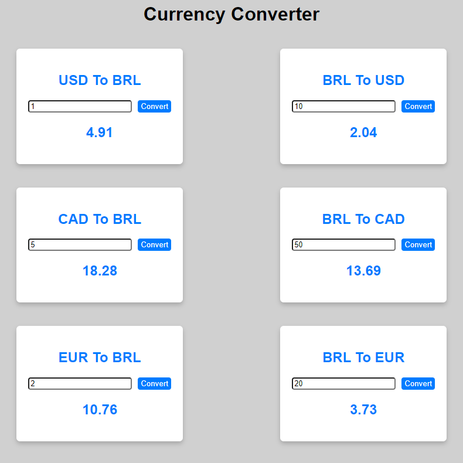

# Currencys Converter

Este é um app feito em Vue JS + VITE que permite ao usuário converter três moedas (Dolar americano, Dolar canadense e Euro) para o real brasileiro e vice versa. Ao digitar um valor e clicar no botão "Covert" correspondente ao campo, o aplicativo faz a conversão do valor digitado, utilizando uma API para buscar o valor de conversão atualizado.

## Como executar o projeto

1. Certifique-se de ter o Node.js instalado em sua máquina.
2. Clone este repositório para o seu computador.
3. Na pasta do projeto, abra o terminal e execute o comando `npm install` para instalar as dependências.
4. Em seguida, execute o comando `npm run dev` para iniciar o servidor de desenvolvimento.
5. O aplicativo será aberto automaticamente no seu navegador. Se não abrir, acesse o endereço especificado no terminal.
